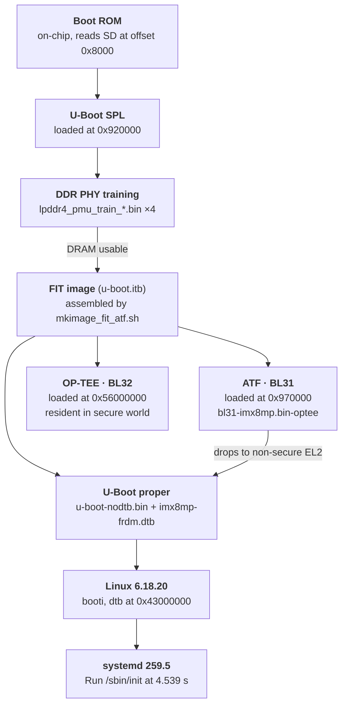

# Vendor BSP Baseline: NXP i.MX8M Plus

The reference point for everything that follows. This is NXP's BSP built and
booted unmodified — no custom layer, no configuration changes beyond what the
setup script writes itself.

Deliberately so. Any later measurement needs something to be measured against,
and a baseline taken after customisation measures the wrong thing.

- BSP: NXP LF6.18.20_2.0.0, manifest `imx-linux-wrynose` / `imx-6.18.20-2.0.0.xml`
- Machine: `imx8mp-lpddr4-frdm` (FRDM-IMX8MPLUS, 4 GB LPDDR4)
- Distro: `fsl-imx-xwayland`
- Image: `imx-image-core`
- Host: WSL2 Ubuntu 24.04, 16 cores, 25 GB RAM + 32 GB swap

Branch selection is recorded in [ADR-0001](adr/0001-yocto-branch-strategy.md);
the migration from the week 1–3 Scarthgap tree in
[ADR-0002](adr/0002-scarthgap-to-wrynose-migration.md).

---

## Scale

The vendor BSP is a different order of magnitude from the Raspberry Pi tree
used in weeks 1–3.

| | Scarthgap / RPi 4B | Wrynose / i.MX8MP |
|---|---|---|
| Repositories | 2 | **27** |
| Recipes parsed | 963 | **4124** |
| Targets | 1925 | 6695 |
| Tasks | 5121 | **10861** |
| `BB_VERSION` | 2.8.1 | 2.18.0 |
| `tmp/` after build | tens of GB | **214 GB** |
| Image | 80 MB, 2082 packages | 363 MB, 1615 packages |

Fewer packages, four times the size. Qt6, Weston and the GPU stack are each
large on their own.

The layer count is not incidental — `meta-qt6`, `meta-clang`,
`meta-virtualization` and `meta-freescale-ml` all arrive with the manifest,
and the parse time and task count follow directly from that.

---

## Boot flow

Every stage announces itself on the serial console, so the chain can be read
straight off a boot log rather than inferred. The load addresses come from the
build tool's own configuration, and they reappear at run time.



| Stage | Evidence in the boot log |
|---|---|
| **Boot ROM** | `Trying to boot from BOOTROM` / `image offset 0x8000, pagesize 0x200` |
| **SPL** | `U-Boot SPL 2026.04-lf_v2026.04+g6eeef838dac+p0` |
| **DDR training** | `DDRINFO: start DRAM init` → `DRAM rate 4000MTS` → `ddrphy calibration done` |
| **ATF (BL31)** | `NOTICE: BL31: v2.14.1(release):lf-6.18.20-2.0.0` |
| **U-Boot proper** | `Model: NXP i.MX8MPlus LPDDR4 FRDM board`, `DRAM: 4 GiB` |
| **Kernel** | `Starting kernel ...`, `CPU: All CPU(s) started at EL2` |
| **Init** | `Run /sbin/init as init process` at 4.539 s |

### What goes into the boot image

`imx-boot` assembles these, all visible in `tmp/deploy/images/<machine>/imx-boot-tools/`:

| Component | Role |
|---|---|
| `u-boot-spl.bin-…` | SPL |
| `lpddr4_pmu_train_{1d,2d}_{dmem,imem}_202006.bin` | DDR PHY training firmware |
| `bl31-imx8mp.bin-optee` | ATF, **built with OP-TEE support** |
| `tee.bin` | OP-TEE (BL32) |
| `u-boot-nodtb.bin` + `imx8mp-frdm.dtb` | U-Boot proper |
| `mkimage_fit_atf.sh` | Packs ATF, OP-TEE and U-Boot into one FIT image |

The build target is `flash_evk`, which `mkimage_imx8` invokes as
`-loader u-boot-spl-ddr.bin <SPL_LOAD_ADDR> -second_loader u-boot.itb` —
SPL together with the DDR firmware as the first loader, the FIT image as the
second.

### The load addresses reappear at run time

`imx-mkimage`'s `soc.mak`, in its `iMX8MP` branch:

```
TEE_LOAD_ADDR ?= 0x56000000
ATF_LOAD_ADDR = 0x00970000
SPL_LOAD_ADDR = 0x920000
```

And the kernel, much later:

```
OF: reserved mem: 0x0000000056000000..0x0000000057dfffff (30720 KiB) nomap non-reusable optee_core@56000000
```

The same address from three places: the build tool decides where OP-TEE is
loaded, the device tree reserves that region, and the kernel stays out of it.

### No HDMI firmware on this SoC

`imx-boot-tools/` contains `signed_hdmi_imx8m.bin`, which suggests HDMI firmware
is part of the boot chain. It is not, here. `soc.mak` selects it only when
`HDMI = yes`, and the `iMX8MP` branch sets:

```
else ifeq ($(SOC),iMX8MP)
PLAT = imx8mp
HDMI = no
```

The file is present because `imx-boot-firmware-files` ships it for the whole
i.MX8M family. The i.MX8MQ needs a signed HDMI firmware loaded during boot; the
i.MX8M Plus uses a different HDMI controller
(`dwhdmi-imx: Detected HDMI TX controller v2.13a`) that does not.

### DDR training is the firmware blob doing its job

The machine configuration declares four binaries:

```
DDR_FIRMWARE_NAME = " \
    lpddr4_pmu_train_1d_dmem_202006.bin \
    lpddr4_pmu_train_1d_imem_202006.bin \
    lpddr4_pmu_train_2d_dmem_202006.bin \
    lpddr4_pmu_train_2d_imem_202006.bin \
"
```

Those are what produce the `DDRINFO` lines. SPL loads them into the DDR PHY's
microcontroller, which calibrates the memory interface; only once that
succeeds is there usable RAM to load anything else into.

They are also exactly the kind of NXP-licensed blob this repository does not
redistribute — fetched by recipe at build time, blocked by `.gitignore`.

### Why this board cannot use mainline

`imx8mp-lpddr4-frdm.conf` says so directly:

```
# Mainline BSP doesn't support LPDDR4 so it must be set to nxp.
IMX_DEFAULT_BSP = "nxp"
```

This was an assumption in ADR-0001. It is now NXP's own statement.

---

## Boot time

```
Startup finished in 4.783s (kernel) + 9.441s (userspace) = 14.224s
graphical.target reached after 9.429s in userspace.
```

The five slowest units:

| Unit | Time | Character |
|---|---|---|
| `dev-mmcblk1p2.device` | 3.494 s | **waiting** |
| `containerd.service` | 3.161 s | work |
| `systemd-modules-load.service` | 1.415 s | work (Wi-Fi firmware) |
| `systemd-udev-trigger.service` | 1.396 s | work |
| `user@0.service` | 726 ms | work |

### `.device` units are waiting, `.service` units are work

`dev-mmcblk1p2.device` at 3.494 s is the SD card becoming ready, not anything
computing. No amount of parallelism or optimisation shortens it; only removing
the dependency or deferring what needs it would.

This is the same distinction the Raspberry Pi baseline arrived at by
accident — one 1.56 s interval there measured identically across two different
CPU clock states, which is only possible if nothing is computing during it.
systemd names the category outright, which makes the classification free
rather than something to be inferred.

### `containerd` in a "core" image

`imx-image-core` is the smallest of the three images the BSP offers, and it
still ships a container runtime that costs 3.161 s of boot time. Vendor BSPs
are configured to demonstrate the silicon, not to be minimal.

### The init system differs from the Raspberry Pi tree

Poky defaults to SysV init; this BSP uses systemd 259.5. The Raspberry Pi
baseline noted that `systemd-analyze` did not apply there — on this platform
it does, and it gives a more complete figure than kernel timestamps because it
covers userspace through to `graphical.target`.

---

## Findings

### A deferred-probe chain has one root and many symptoms

```
adp5585 1-0034: error -ENXIO: Failed to read device ID        ← root
  regulator-dvdd_0        : supplier 1-0034 not ready
  regulator-hmisc-vddio_0 : supplier 1-0034 not ready
  regulator-vddo_0        : supplier 1-0034 not ready
  regulator-avdd_0        : supplier 1-0034 not ready
    i2c 1-003c            : supplier regulator-hmisc-vddio_0 not ready
      32c00000.bus:camera : deferred probe pending: (reason unknown)
```

Confirmed with `i2cdetect -y -r 1`: address `0x34` is empty. The device tree
describes power control for a camera expansion board that is not fitted.

Worth noting for its own sake: the least informative line —
`deferred probe pending: (reason unknown)` — belongs to the node furthest
downstream. **The root cause is at the top of the chain, and the symptom
furthest from it is the one with no explanation attached.**

### Weston fails without a display

`weston.service` exits 1 five times and systemd gives up. No `weston.log` is
written, which is itself informative: it dies before opening its log file.
With HDMI attached it starts normally.

The kernel says the same thing earlier and more plainly:

```
imx-drm display-subsystem: [drm] Cannot find any crtc or sizes
```

### TrustZone and virtualisation are both active out of the box

```
optee: revision 4.10 (37c7fbf84c40eb9e)
OF: reserved mem: optee_core@56000000 (30720 KiB) nomap
caam-snvs 30370000.caam-snvs: violation handlers armed - non-secure state

CPU: All CPU(s) started at EL2
kvm [1]: Hyp nVHE mode initialized successfully
```

OP-TEE occupies a reserved memory region, the CAAM cryptographic accelerator
has its tamper handlers armed, and the CPUs come up at EL2 with KVM
initialised. The BSP also carries `meta-virtualization` and a device tree for
jailhouse (`imx8mp-jailhouse-inmate.dtb`).

None of this needed enabling. It is the default posture of an automotive-
oriented SoC BSP, and it is the environment the secure-boot work in week 8
will be done in.

---

## Build cost

Reaching a working image took roughly ten hours across four attempts, three of
which failed in different ways. Details are in the working notes; the
measurements that matter here:

| Attempt | Outcome | Wall clock |
|---|---|---|
| 1 | OOM at 80% (8692 / 10861 tasks) | 430 m |
| 2 | Interrupted by a host firmware update | — |
| 3 | `do_package` failed on a corrupted pseudo database | 36 m |
| 4 | **Succeeded**, all 10861 tasks | 146 m |

The first attempt ran with `BB_NUMBER_THREADS` and `PARALLEL_MAKE` both
defaulting to `nproc` (16). Those multiply: up to 256 concurrent compiler
processes, and `rust-native`, `clang-native`, `qtbase`, `boost` and `gcc` were
all in `do_compile` simultaneously.

At 6×6, the same five recipes compile concurrently in 11 GB of 25 GB with
swap untouched.

The early warning was legible before the kill:

```
NOTE: No reply from server in 30s (for command ping at 23:35:47)
```

bitbake's own process could not reach its server. That line is worth treating
as a signal to reduce parallelism rather than a transient.

---

## Open items

- Weston's failure is attributed to the absent display rather than confirmed
  from its own output — it exits before writing a log. Confirmed working with
  HDMI attached, which is sufficient for now. The graphics stack is scheduled
  for removal when the distro is customised, so this will not persist.
- Kernel configuration was not inspected for `CONFIG_CAN_ISOTP`, needed for
  the UDS work in week 9. `can-isotp` appears in none of the 27 layers, so it
  will have to come from kernel configuration or an additional layer.
